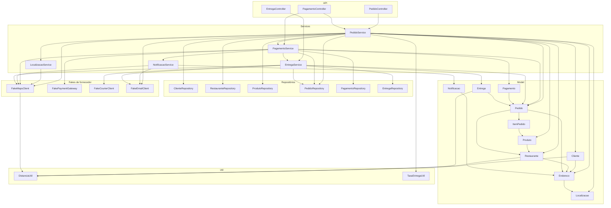

# Atividade 06 (FoodNow)

Bryan Charles e Guilherme Sartori

## Baseline de verificação

Estado do repositório antes de qualquer alteração, com JDK 26 e Maven 3.9.9.

```
mvn clean verify  ->  BUILD SUCCESS
Testes unitários  23, falhas 0
Testes de API      5, falhas 0
```

Cobertura medida pelo JaCoCo sobre o bundle inteiro.

| Contador | Coberto/Total | Percentual |
|---|---|---|
| Linhas | 684/703 | 97,30% |
| Instruções | 3602/3763 | 95,72% |
| Branches | 101/138 | 73,19% |
| Métodos | 262/278 | 94,24% |
| Complexidade | 295/347 | 85,01% |

A regra do build exige 80% de linhas, então existe folga de 17 pontos. Por pacote as linhas
ficam em 100% para `controller`, `integration` e `util`, 98,92% para `model` e 94,47% para
`service`. As três classes menos cobertas são justamente as que a refatoração ataca,
`LocalizacaoService` com 85,71%, `ClienteService` com 90,00% e `PedidoService` com 91,89%.
O contador mais frágil é branches, então qualquer decisão nova precisa nascer com teste.

## 1. Pontos identificados

Doze pontos, cobrindo seis tipos de componente. A coluna "tipo" usa domínio para entidades JPA,
service para camada de aplicação, util para os estáticos, integração para os fakes de fornecedor,
API para controller e DTOs, e persistência para o que fica gravado no banco.

### Ponto 1

**Classe e método** `service.PedidoService.criar`, bloco das distâncias.
**Tipo** service.
**Responsabilidade encontrada** Obter a distância entre restaurante e endereço de entrega por
cinco caminhos independentes e adotar o maior valor como distância oficial do pedido.
**Dependências envolvidas** `LocalizacaoService`, `FakeMapsClient` concreto, `Restaurante`,
`Endereco`, `Localizacao` e por baixo deles `DistanciaUtil`.
**Problema arquitetural** Não existe fonte única de verdade para distância. O `Math.max`
aninhado é uma política de reconciliação implícita, escrita como expressão e não como decisão
nomeada, e mistura Haversine, aproximação cartesiana em graus, fórmula própria de `Endereco`,
Manhattan e trajeto do provedor, que são grandezas conceitualmente diferentes.
**Impacto provável da mudança** Passar a considerar trajeto, região e horário obriga a revisitar
as cinco origens, decidir quais sobrevivem e onde o horário entra. Como o resultado alimenta
aceitação, taxa e o campo `distanciaEntregaKm` da resposta, qualquer ajuste é observável na API.

### Ponto 2

**Classe e método** `service.PedidoService.criar`, bloco das taxas via `maiorTaxa`.
**Tipo** service.
**Responsabilidade encontrada** Compor a taxa de entrega escolhendo o maior valor entre cinco
fórmulas e depois somar o adicional geográfico dos itens.
**Dependências envolvidas** `TaxaEntregaUtil`, `Restaurante.calcularTaxaEntrega`,
`Endereco.calcularTaxaLocalAte`, `Cliente.calcularTaxaEntregaDoRestaurante`,
`Pedido.calcularTaxaEntregaPorDistancia` e `Pedido.calcularAdicionalGeograficoDosItens`.
**Problema arquitetural** A política comercial de frete está distribuída entre um utilitário
estático e quatro entidades, e a regra que as combina mora dentro de um caso de uso. Cada
fórmula tem base fixa e multiplicador próprios, de 3,75 a 6,00 de base e de 1,10 a 1,45 por km,
sem nenhum lugar que explique por que convivem.
**Impacto provável da mudança** Uma tabela de preço por região e faixa de horário teria de ser
replicada nas cinco fórmulas ou obrigaria a decidir de uma vez qual é a verdadeira, o que muda
`taxaEntrega` e `valorTotal` na resposta de pedido.

### Ponto 3

**Classe e método** `service.PedidoService.criar`, condição de área de entrega.
**Tipo** service.
**Responsabilidade encontrada** Aprovar ou rejeitar o pedido testando três critérios diferentes
de atendimento na mesma expressão, `distancia > raioEntregaKm`,
`cliente.estaDentroDaAreaDeEntrega` e `restaurante.atendeEndereco`.
**Dependências envolvidas** `Cliente`, `Restaurante`, `Endereco.pertenceARegiaoDo`.
**Problema arquitetural** Os três critérios usam distâncias e definições de região distintas.
O primeiro usa o máximo das cinco, o segundo usa Haversine do endereço principal do cliente, que
pode nem ser o endereço de entrega escolhido, e o terceiro combina Haversine com igualdade de
cidade e prefixo de CEP. É uma conjunção acidental, não uma política declarada.
**Impacto provável da mudança** Regra de cobertura por região e horário precisaria entrar em três
lugares com semânticas diferentes, com risco alto de passar a rejeitar pedidos hoje aceitos.

### Ponto 4

**Classe e método** `model.Pedido.calcularDistanciaEntrega`, `calcularTaxaEntregaPorDistancia`,
`verificarEnderecoAtendido`, `determinarRegiaoEntrega`, `estimarTempoEntregaPeloPedido` e
`possuiDivergenciaDeDistancia`.
**Tipo** domínio.
**Responsabilidade encontrada** O pedido reimplementa distância, taxa, atendimento, região e
tempo, e ainda compara o valor persistido com o próprio cálculo.
**Dependências envolvidas** `Restaurante.buscarLatitude/buscarLongitude`, `Endereco`,
`Localizacao`, `ItemPedido`.
**Problema arquitetural** Uma entidade que deveria guardar dados e invariantes de composição do
pedido virou mais uma calculadora geográfica. `possuiDivergenciaDeDistancia` é a evidência mais
direta do problema, o sistema já sabe que suas fontes divergem e transformou isso em consulta.
**Impacto provável da mudança** Rota real tornaria a divergência permanente, já que a fórmula
interna continua sendo linha reta em graus. O tempo estimado do pedido vaza para o e-mail de
confirmação e para o cálculo de tempo da entrega.

### Ponto 5

**Classe e método** `model.Endereco.calcularDistanciaAte`, `estimarMinutosAte`,
`classificarZonaDeEntrega`, `pertenceARegiaoDo` e `calcularTaxaLocalAte`.
**Tipo** domínio.
**Responsabilidade encontrada** Um cadastro postal decide distância, tempo, zona logística,
pertinência de região e preço de frete.
**Dependências envolvidas** `Localizacao` e os literais `Centro`, `Ponta Grossa` e prefixo de CEP.
**Problema arquitetural** Coesão baixa e regra de negócio codificada em literal. A definição de
região aqui compete com a zona do provedor e com o raio do restaurante, e as três aparecem na
mesma resposta da API com nomes diferentes.
**Impacto provável da mudança** Nova regionalização toca a entidade mais reutilizada do sistema,
usada por cliente, restaurante, produto, pedido, entrega e notificação.

### Ponto 6

**Classe e método** `model.Cliente.calcularDistanciaAte`, `estaDentroDaAreaDeEntrega`,
`calcularTaxaEntregaDoRestaurante`, `estimarTempoAte` e `identificarRegiaoPrincipal`.
**Tipo** domínio.
**Responsabilidade encontrada** O cliente conhece geometria, política logística e preço, sempre
a partir de `enderecoPrincipal`.
**Dependências envolvidas** `Restaurante`, `Endereco`, `DistanciaUtil`.
**Problema arquitetural** Além do acoplamento de cadastro com logística, existe um defeito
latente de modelagem, o pedido é criado para um `enderecoEntregaId` escolhido pelo cliente, mas
`estaDentroDaAreaDeEntrega` valida o endereço principal. Quando os dois divergem, a aceitação e a
taxa são decididas sobre um endereço que não é o da entrega.
**Impacto provável da mudança** Qualquer regra de cobertura por região e horário aplicada aqui
herda o endereço errado.

### Ponto 7

**Classe e método** `model.Restaurante.calcularDistanciaAte`, `calcularTaxaEntrega`,
`atendeEndereco`, `classificarRegiaoDeEntrega`, `estimarTempoEntrega`, `buscarLatitude` e
`buscarLongitude`.
**Tipo** domínio.
**Responsabilidade encontrada** O cadastro do restaurante executa mais uma fórmula de distância,
mais uma de taxa, define cobertura, classifica região em `PROXIMA`, `LIMITE` e `FORA_DA_REGIAO`,
estima tempo e ainda expõe coordenadas cruas.
**Dependências envolvidas** `Endereco`, `Localizacao`, `DistanciaUtil`.
**Problema arquitetural** `buscarLatitude` e `buscarLongitude` existem apenas para alimentar
cálculo externo em `Pedido`, o que é encapsulamento vazando por conveniência.
`classificarRegiaoDeEntrega` cria um terceiro vocabulário de região no sistema.
**Impacto provável da mudança** Política comercial e logística passa a exigir alteração no
cadastro, e o vocabulário de região precisa ser reconciliado com zona do mapa e zona do endereço.

### Ponto 8

**Classe e método** `model.Produto.podeSerEntregueEm` e `calcularAdicionalRegional`, com
`model.ItemPedido.calcularParcelaGeografica`.
**Tipo** domínio, fronteira de catálogo.
**Responsabilidade encontrada** O item de catálogo conhece endereço de destino, raio do
restaurante, zona e distância, e o item do pedido multiplica esse adicional pela quantidade.
**Dependências envolvidas** `Restaurante`, `Endereco`, `Localizacao`.
**Problema arquitetural** A tarifa logística passou a depender da composição do pedido. O
adicional é `distancia * 0,08` por unidade quando a zona não é `CENTRAL`, então pedir dez
unidades do mesmo item multiplica por dez a parcela geográfica, o que é uma decisão de preço
tomada dentro do catálogo sem estar declarada em lugar nenhum.
**Impacto provável da mudança** Mudança de logística altera catálogo, e mudança de catálogo
altera o valor final do frete.

### Ponto 9

**Classe e método** `util.DistanciaUtil.calcularKm` e `util.TaxaEntregaUtil.calcular`.
**Tipo** util.
**Responsabilidade encontrada** Haversine compartilhado e faixa de taxa com corte em 3 km.
**Dependências envolvidas** `Localizacao`, e do outro lado praticamente todo o sistema, incluindo
`FakeMapsClient`.
**Problema arquitetural** São regras centrais expostas como estático global, sem dono funcional.
O fato de o fake de mapas usar `DistanciaUtil` apaga a fronteira entre fornecedor externo e regra
interna, o provedor simulado é literalmente a regra interna multiplicada por 1,15.
**Impacto provável da mudança** Estático não aceita parametrização por região e horário sem virar
uma assinatura cada vez maior, e por ser estático não é substituível em teste nem por composição.

### Ponto 10

**Classe e método** `integration.FakeMapsClient.calcularRota`.
**Tipo** integração.
**Responsabilidade encontrada** Simular o provedor e, no mesmo lugar, fixar o fator de trajeto
1,15, a velocidade de 3,5 minutos por km, o piso de 12 minutos e o corte de zona
`CENTRAL`/`EXPANDIDA` em 5 km.
**Dependências envolvidas** `DistanciaUtil`, `Localizacao`.
**Problema arquitetural** Regra de negócio morando no adaptador de fornecedor, sem tradução. Os
records `RouteResult` e `MapCoordinates` circulam crus por seis classes de aplicação, com
vocabulário em inglês e `String` para zona e coordenadas.
**Impacto provável da mudança** Trocar de provedor, ou apenas enriquecer a rota com horário,
altera diretamente sete consumidores. Vale registrar que `calcularRota` é chamado três vezes com
os mesmos argumentos no trecho pagar mais criar entrega, em `PagamentoService`,
`NotificacaoService` e `EntregaService`, o que só não gera divergência porque o fake é
determinístico e não custa nada.

### Ponto 11

**Classe e método** `service.LocalizacaoService.buscarCoordenadas` e `calcularDistancia`, com
`service.ClienteService.adicionarEndereco`.
**Tipo** service, camada de borda.
**Responsabilidade encontrada** Converter a resposta do provedor em `Localizacao` fazendo
`Double.parseDouble` de `String`, e no cliente repetir a chamada ao fake para inspecionar
`precision` igual a `APPROXIMATE`.
**Dependências envolvidas** `FakeMapsClient.MapCoordinates`, `Localizacao`.
**Problema arquitetural** O serviço que deveria ser a barreira contra o provedor é o que mais
conhece o formato dele. Pior, `ClienteService` chama `LocalizacaoService.buscarCoordenadas` e
logo depois chama `mapsClient.buscarCoordenadas` de novo, para o mesmo endereço, só para ler um
campo que o serviço descartou. A abstração existe e é contornada.
**Impacto provável da mudança** Um provedor que devolva precisão ou região em outro formato
quebra a borda e o cadastro de cliente ao mesmo tempo.

### Ponto 12

**Classe e método** `service.PagamentoService.processar`, `service.NotificacaoService`
`.notificarPagamento` e `service.EntregaService.criarPara`.
**Tipo** service com integração, e o resultado alcança persistência e API.
**Responsabilidade encontrada** Pagamento recalcula rota, monta `GatewayRequest` com zona e
coordenadas formatadas, interpreta a `String` `AUTHORIZED`, altera o pedido, persiste, notifica e
manda criar entrega. Notificação recalcula a rota de novo para escrever o e-mail. Entrega
recalcula a rota uma terceira vez, escolhe o máximo de três distâncias, resolve zona por
preferência ao provedor e guarda `statusDespachoExterno` cru.
**Dependências envolvidas** `FakePaymentGateway`, `FakeMapsClient`, `FakeCourierClient`,
`PedidoRepository`, `PagamentoRepository`, `EntregaRepository`, `Pedido`, `Pagamento`, `Entrega`.
**Problema arquitetural** Direção de dependência invertida entre funcionalidades, pagamento
comanda entrega e notificação. Detalhe de fornecedor é persistido em `Pagamento.codigoExterno`,
`mensagemProvedor` e em `Entrega.statusDespachoExterno`, e depois exposto na API por
`PagamentoResponse` e `EntregaResponse`. `Pagamento.possuiRiscoGeografico` decide risco lendo
região e distância que vieram do mapa, então o modelo de pagamento passou a depender de política
geográfica.
**Impacto provável da mudança** Região e horário na taxa mudam o valor pago, a zona enviada ao
gateway, o texto do e-mail, a zona do despacho e o custo operacional da entrega, tudo de uma vez.

### Cobertura por tipo de componente

| Tipo | Pontos |
|---|---|
| Domínio | 4, 5, 6, 7, 8 |
| Service | 1, 2, 3, 11, 12 |
| Util | 9 |
| Integração | 10, 12 |
| API | 12, e os DTOs `AtendimentoClienteResponse` e `SimulacaoRestauranteResponse` |
| Persistência | 4, 12 |

## 2. Mapa de dependências do fluxo

Fluxo `criar pedido -> confirmar -> pagar -> criar/consultar entrega`.



### Passo a passo, com o que é decidido em cada etapa

**Etapa 1, criar pedido.** `POST /pedidos` chega em `PedidoController` e desce para
`PedidoService.criar`, que tem oito dependências de construtor. O método carrega cliente,
restaurante e produtos por três repositórios, procura o endereço na lista do cliente, calcula
distância por cinco caminhos, aplica três critérios de aceitação, compõe taxa por cinco fórmulas,
adiciona itens validando disponibilidade e logística no catálogo, e no fim soma o adicional
geográfico dos itens chamando `definirEntrega` uma segunda vez. Atravessa cliente, restaurante,
catálogo, localização, preço e persistência.

**Etapa 2, confirmar.** `PedidoService.confirmar` muda o status e envia e-mail direto pelo
`FakeEmailClient`, sem passar por `NotificacaoService`. A mensagem usa
`Pedido.determinarRegiaoEntrega` e `Pedido.estimarTempoEntregaPeloPedido`, ou seja o texto do
e-mail depende das fórmulas próprias do pedido.

**Etapa 3, pagar.** `PagamentoController` chama `PedidoService.pagar`, que apenas delega para
`PagamentoService.processar`. Aqui a rota é recalculada, a requisição do gateway recebe zona e
coordenadas formatadas para provedor, o status textual é traduzido, o pedido é alterado e salvo,
o pagamento é persistido com código e mensagem do fornecedor, a notificação é disparada e, se
aprovado, a entrega é criada. Um caso de uso de pagamento comanda três funcionalidades vizinhas.

**Etapa 4, criar entrega.** `EntregaService.criarPara` recalcula a rota, compara três distâncias
e fica com a maior, resolve zona dando preferência a `EXPANDIDA` do provedor, monta a requisição
do despachante, soma o tempo do provedor com o tempo do pedido e o tempo de coleta, e persiste
`codigoEntregadorExterno` e `statusDespachoExterno` crus.

**Etapa 5, consultar entrega.** `GET /entregas/{id}` monta `EntregaResponse`, que chama
`Entrega.calcularCustoOperacional`, que por sua vez chama `calcularDistanciaPeloEndereco`. Existe
cálculo geográfico acontecendo na serialização da resposta.

### Concentrações visíveis no mapa

`FakeMapsClient` é alcançado por sete caminhos. Cinco estão dentro deste fluxo, `PedidoService`
direto, `PedidoService` via `LocalizacaoService`, `PagamentoService`, `NotificacaoService` e
`EntregaService`. Os outros dois são `ClienteService` e `RestauranteService`, que ficam fora do
fluxo `criar -> confirmar -> pagar -> entregar` e por isso não aparecem no diagrama, mas chegam ao
mesmo fake pelo cadastro de endereço e pelas simulações de atendimento e de entrega. Vale
registrá-los porque contam para o raio de impacto de uma troca de provedor.

`FakeEmailClient` é alcançado por três caminhos independentes, `PedidoService` direto,
`NotificacaoService` e `EntregaService` direto. `DistanciaUtil` é alcançado por quatro entidades e
pelo próprio fake de mapas, o que fecha um laço conceitual entre domínio e integração.

No fluxo inteiro a rota do provedor é calculada cinco vezes com os mesmos dois pontos, duas na
criação do pedido, por `LocalizacaoService.calcularDistancia` e pelo `mapsClient.calcularRota`
chamado direto no `PedidoService`, uma no pagamento, uma na notificação e uma na entrega.

## 3. Refatoração aplicada

O ponto de apoio é que nenhuma das fórmulas pode simplesmente sumir. Os valores divergentes são
comportamento observável, aparecem em `distanciaClienteKm`, `distanciaEnderecoKm` e
`distanciaProvedorKm` na simulação de atendimento, em `distanciaRestauranteKm`,
`distanciaEnderecosKm`, `distanciaProvedorKm`, `regiaoRestaurante` e `zonaProvedor` na simulação
do restaurante, e no máximo que define `distanciaEntregaKm` e `taxaEntrega` do pedido. A
estratégia foi dar dono às regras sem mexer em nenhum número.

Nasceu o pacote `br.edu.foodnow.localizacao`, que é o limite novo.

| Elemento | Papel |
|---|---|
| `Rota` | Objeto de valor com distância, duração e região, sem vocabulário de fornecedor |
| `Geocodificacao` | Coordenadas resolvidas mais a indicação de resultado aproximado |
| `MapaGateway` | Porta de saída para consulta geográfica, declarada do lado da aplicação |
| `MapaGatewayFake` | Adaptador que embrulha `FakeMapsClient` e traduz os records dele |
| `RotaEntrega` | Rota já reconciliada, guarda o valor adotado e o que o provedor respondeu |
| `CalculadoraRotaEntrega` | Dono das distâncias concorrentes e da reconciliação de região |
| `PoliticaTaxaEntrega` | Dona das cinco fórmulas de frete e do adicional geográfico dos itens |
| `PoliticaAreaAtendimento` | Dona dos três critérios de aceitação |
| `PlanoDeEntrega` | Rota reconciliada e decisão de atendimento entregues juntas |
| `PlanejamentoDeEntrega` | Fachada que o caso de uso consome, esconde as três peças acima |

`LocalizacaoService` foi removido. Ele existia para converter os records do provedor, que é
exatamente o trabalho do adaptador, e continuava sendo contornado por `ClienteService`, que
chamava o fake diretamente logo depois de chamá-lo.

O segundo fluxo escolhido foi notificação. `NotificacaoService` virou a única porta de saída de
mensagem, ganhou `notificarPedidoConfirmado` e `notificarEntregaIniciada`, e deixou de consultar
o mapa por conta própria, agora recebe a `Rota` de quem já a calculou.

### Os quatro pontos exigidos pelo enunciado

**Redução de responsabilidades de uma classe.** `PedidoService.criar` perdeu o cálculo das cinco
distâncias, a composição das cinco taxas, os três critérios de aceitação e o envio direto de
e-mail. O método caiu de trinta para dezenove linhas e passou a expressar a intenção do caso de
uso, carregar os dados, pedir o plano de entrega, recusar se não for atendido, montar o pedido e
salvar. O construtor foi de oito para sete dependências e, mais relevante, de duas integrações
concretas para nenhuma.

**Concentração de regras dispersas.** Foram três concentrações. As distâncias concorrentes agora
vivem em `CalculadoraRotaEntrega`, as cinco fórmulas de taxa em `PoliticaTaxaEntrega` e os três
critérios de atendimento em `PoliticaAreaAtendimento`, que passou a atender também
`ClienteService.simularAtendimento`, onde os mesmos três critérios estavam repetidos em outra
ordem. A reconciliação de região do despacho, que era um ternário dentro de `EntregaService`,
virou `regiaoDeDespacho`.

**Redução da dependência de integração geográfica concreta.** `FakeMapsClient` era referenciado
por sete classes de aplicação e passou a ser referenciado por uma, o adaptador. Nenhum serviço
conhece mais `MapCoordinates`, `RouteResult`, `EXACT` ou `APPROXIMATE`.

**Limite claro para a regra futura.** Trajeto, região e horário entram em `CalculadoraRotaEntrega`
e `PoliticaTaxaEntrega`, atrás de `PlanejamentoDeEntrega`. O caso de uso, as entidades e os
fornecedores não precisam saber.

## 4. Comparação antes e depois

### Dependências por serviço

| Serviço | Antes | Depois |
|---|---|---|
| `PedidoService` | 8, sendo 2 integrações concretas | 7, sendo 0 |
| `RestauranteService` | 4, sendo 1 | 3, sendo 0 |
| `ClienteService` | 4, sendo 1 | 4, sendo 0 |
| `NotificacaoService` | 2, sendo 2 | 1, sendo 1 |
| `EntregaService` | 5, sendo 3 | 5, sendo 1 |
| `PagamentoService` | 6, sendo 2 | 6, sendo 1 |
| `LocalizacaoService` | 1, sendo 1 | removido |

`ClienteService`, `EntregaService` e `PagamentoService` mantiveram a contagem porque trocaram uma
dependência concreta por uma abstrata em vez de perder colaborador. É o tipo de ganho que o número
sozinho não mostra, o que mudou foi a direção da dependência.

### Alcance das integrações

| Integração | Classes que a referenciavam | Depois |
|---|---|---|
| `FakeMapsClient` | 7 | 1, o adaptador |
| `FakeEmailClient` | 3 | 1, a fachada de notificação |

No fluxo `criar -> confirmar -> pagar -> entregar` a rota era calculada cinco vezes com os mesmos
dois pontos, duas na criação do pedido, uma no pagamento, uma na notificação e uma na entrega.
Agora são três. As duas removidas eram provadamente redundantes, o provedor é determinístico e
puro, e o golden master confirma que nenhum valor mudou.

### Componentes alcançados pelo requisito futuro

O requisito de considerar trajeto, região e horário na taxa.

| Antes | Depois |
|---|---|
| `Cliente`, `Endereco`, `Localizacao`, `Restaurante`, `Produto`, `ItemPedido`, `Pedido`, `Pagamento`, `Entrega`, `Notificacao` | nenhuma entidade precisa mudar para a taxa passar a considerar rota, região e horário |
| `ClienteService`, `RestauranteService`, `PedidoService`, `LocalizacaoService`, `PagamentoService`, `NotificacaoService`, `EntregaService` | nenhum service, o cálculo entra atrás de `PlanejamentoDeEntrega` |
| `DistanciaUtil`, `TaxaEntregaUtil` | continuam como fórmulas, mas passam a ser chamadas de um lugar só |
| `FakeMapsClient`, `FakePaymentGateway`, `FakeCourierClient` | `MapaGateway` e seu adaptador, se a rota precisar carregar horário |
| Cerca de vinte e dois pontos de alteração | `CalculadoraRotaEntrega` e `PoliticaTaxaEntrega`, mais o adaptador se o contrato da rota crescer |

### Trade-offs assumidos

O maior deles é que a duplicação não foi eliminada, foi encapsulada. As cinco fórmulas de
distância e as cinco de taxa continuam existindo dentro dos novos componentes, porque apagá-las
mudaria valores que a API expõe. O ganho é ter um dono e um lugar para a decisão, o custo é que
alguém que abrir `PoliticaTaxaEntrega` ainda vai encontrar cinco fórmulas. A diferença é que agora
é possível remover uma delas de propósito, com um teste dizendo qual valor muda.

O segundo é que `PlanejamentoDeEntrega` é uma fachada sobre três componentes e adiciona um salto
de indireção. Ela se paga porque o caso de uso passa a ter um colaborador em vez de três e porque
a composição de rota, área e taxa é justamente o que o requisito futuro vai alterar em conjunto.
Sem ela, `PedidoService` terminaria com nove dependências, mais do que tinha antes.

O terceiro é que as entidades continuam com seus métodos geográficos. Removê-los seria a mudança
mais profunda e alcançaria os testes unitários existentes e a semântica de vários campos da API.
Ficou de fora conscientemente.

## 5. Problemas deixados fora do escopo

**Regras geográficas dentro das entidades.** `Cliente`, `Endereco`, `Restaurante`, `Produto`,
`ItemPedido`, `Pedido`, `Pagamento` e `Entrega` continuam calculando distância, taxa, região e
tempo. Justificativa, esses métodos são chamados pelas novas políticas e por vários campos da API,
e vários deles são verificados diretamente pelos testes unitários de modelo. Movê-los agora
misturaria a reorganização do limite com uma mudança de modelagem muito maior. O limite criado é o
pré requisito para fazer isso depois, uma entidade por vez.

**Acoplamento de `PagamentoService` ao gateway.** A montagem de `GatewayRequest`, a leitura de
`AUTHORIZED` e `DECLINED` e a persistência de `codigoExterno` e `mensagemProvedor` continuam como
estavam. Justificativa, a atividade pede a criação do pedido mais um fluxo relacionado, e o fluxo
escolhido foi notificação. O caminho para pagamento é o mesmo que foi usado aqui, uma porta com
resultado interno normalizado e adaptadores por provedor.

**`EntregaService` altera o status do pedido e `PagamentoService` cria a entrega.** A direção de
dependência entre as três funcionalidades continua invertida. Justificativa, corrigir isso exige
decidir entre orquestrador e eventos, e eventos trazem ordem, política de falha e rastreabilidade
que não cabem no tamanho desta entrega.

**`Pagamento.possuiRiscoGeografico` e `Entrega.calcularCustoOperacional`.** Continuam decidindo
política geográfica dentro do modelo, e o custo operacional ainda é calculado na montagem do DTO
de resposta. Justificativa, os dois são campos observáveis da API e dependem de `zonaEntrega` e
`regiaoEntrega` persistidos, então mexer neles é mudança de contrato, não de estrutura.

**`RestauranteService` como serviço de produto e `ApiDtos` importando records de service.**
Justificativa, são problemas reais de limite funcional, mas fora do recorte de localização e
entrega desta atividade.

**`FetchType.EAGER` e navegação profunda no grafo JPA.** Justificativa, é trade-off de
performance e de acoplamento ao modelo de persistência, discutido nas notas do professor como não
sendo o problema central.

## 6. Resultado do build

Comando `mvn clean verify`, JDK 26 e Maven 3.9.9.

| | Antes | Depois |
|---|---|---|
| Build | SUCCESS | SUCCESS |
| Testes unitários | 23 | 39 |
| Testes de API | 5 | 5 |
| Cobertura de linhas | 97,30% (684/703) | 97,85% (727/743) |
| Cobertura de branches | 73,19% (101/138) | 79,85% (107/134) |

Nenhuma exclusão nova foi adicionada ao JaCoCo e os três arquivos protegidos, `FoodNowFlowIT`,
`FoodNowErrorsIT` e `ApiTestSupport`, não foram tocados.

Foram acrescentados dezesseis testes, doze em `LocalizacaoTest` e quatro em
`NotificacaoServiceTest`. Eles são de caracterização, fixam a reconciliação de distância pela
maior fórmula, a taxa pela maior das cinco, os três critérios de atendimento recusando de forma
independente, a tradução do provedor pelo adaptador e os textos das três notificações. O caso mais
útil é o do raio de 1,3 km, em que a distância reconciliada recusa o pedido enquanto o Haversine
do cliente ainda aceitaria, que documenta exatamente por que a reconciliação importa.

### Verificação de equivalência

Além da suíte, o comportamento observável foi comparado diretamente. Um harness temporário
percorreu cinquenta e seis requisições cobrindo o fluxo completo aprovado, pagamento rejeitado,
produto indisponível, endereço fora da área, erros de validação, recursos inexistentes e uma
entrega em região expandida, gravando código de status e corpo de cada resposta mais todas as
notificações enviadas. O mesmo harness rodou contra o código original em uma worktree do commit
base e contra o código refatorado. As duas saídas são idênticas byte a byte. O harness era
instrumento de verificação, não asserção, e foi removido depois da comparação.
