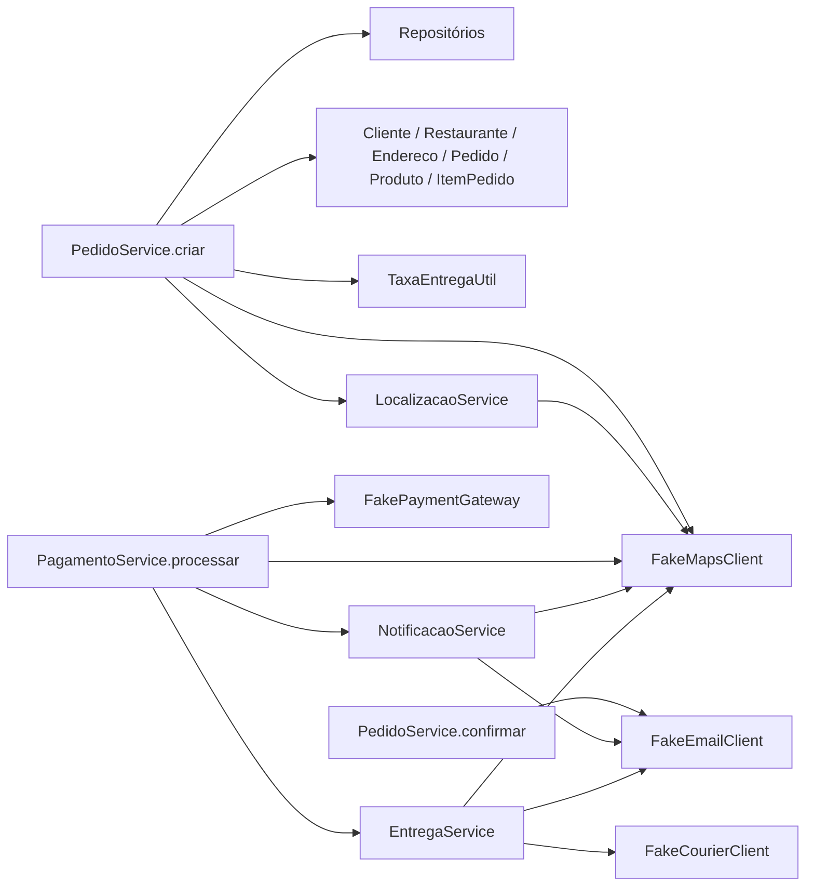
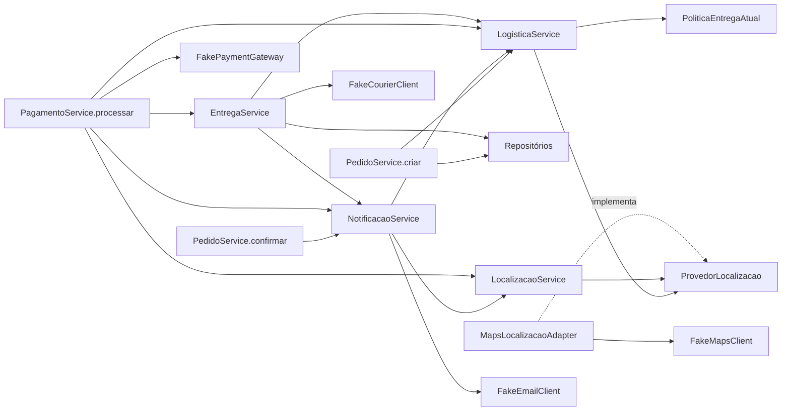

# Atividade 06 — solução de referência

Esta solução fornece uma base refatorada para a Atividade 07. Mantém o FoodNow monolítico, as integrações simuladas e os contratos HTTP existentes. Não implementa a futura regra de horário nem o campo de observação proposto na Atividade 07.

## Levantamento da versão inicial

Referência anterior à refatoração: commit `310b1f8`. Os nomes abaixo identificam os pontos originais, inclusive métodos que foram extraídos ou removidos.

| Classe e método | Responsabilidade | Dependências | Problema arquitetural | Impacto de uma mudança de rota, região ou horário |
|---|---|---|---|---|
| `PedidoService.criar` | Carregar recursos, aceitar endereço, escolher distância e tarifa, montar e salvar pedido | Quatro repositórios, `LocalizacaoService`, `FakeMapsClient`, entidades, `TaxaEntregaUtil` | Coordenação misturada com política logística e detalhe externo | Alterar a taxa exige editar o caso de uso e conhecer várias fórmulas |
| `Pedido.calcularDistanciaEntrega`, `calcularTaxaEntregaPorDistancia`, `estimarTempoEntregaPeloPedido` | Calcular distância cartesiana, tarifa e prazo internos | Restaurante, endereço e itens | Entidade de pedido também define política geográfica | Mudar logística afeta o agregado e seus consumidores |
| `Pedido.determinarRegiaoEntrega` | Classificar a região utilizada na confirmação e no pagamento | Endereços de origem e destino | Região do pedido acopla mensagens, pagamento e cadastro | Mudança de classificação alcança fluxos diferentes |
| `Produto.calcularAdicionalRegional` | Calcular acréscimo logístico unitário | Restaurante, distância do endereço e zona do destino | Catálogo conhece tarifa de entrega | Uma política regional altera produto |
| `ItemPedido.calcularParcelaGeografica` | Multiplicar adicional regional pela quantidade | Produto e destino | Item participa da política logística além de calcular subtotal | Uma mudança de taxa percorre produto, item e pedido |
| `Cliente.estaDentroDaAreaDeEntrega`, `calcularTaxaEntregaDoRestaurante` | Validar raio e calcular tarifa pelo endereço principal | Endereço principal, restaurante, `DistanciaUtil` | Atendimento interfere no pedido mesmo quando ele usa outro endereço | Trocar a regra pode alterar aceitação e preço de pedidos existentes |
| `Endereco.calcularDistanciaAte`, `pertenceARegiaoDo`, `calcularTaxaLocalAte` | Aproximar distância, comparar cidade/CEP e calcular taxa | Coordenadas, cidade, CEP | Objeto de endereço acumula políticas operacionais | Mudanças de região alcançam cadastro, pedido, simulação e entrega |
| `Restaurante.atendeEndereco`, `calcularTaxaEntrega` | Validar atendimento e calcular outra tarifa | Endereço, raio e `DistanciaUtil` | Fonte adicional de atendimento/preço | Consolidar sem caracterização pode mudar resultados |
| `EntregaService.criarPara` | Combinar distâncias, zona e prazo; despachar e persistir | `FakeMapsClient`, `FakeCourierClient`, pedido, endereço, repositório | Política logística misturada com integração e persistência | Alterar mapas ou estimativa exige editar o fluxo de entrega |
| `PagamentoService.processar` | Validar estado, pagar, registrar região/distância e disparar efeitos | Repositórios, mapas, gateway, pedido, notificação e entrega | Pagamento depende da estrutura concreta de mapas | Mudança no provedor geográfico chega ao pagamento |
| `NotificacaoService.notificarPagamento`, `PedidoService.confirmar`, `EntregaService.atualizarStatus` | Compor e enviar mensagens | Mapas, entidades e `FakeEmailClient` | Notificação distribuída em três serviços | Alterar texto ou canal exige localizar vários pontos |
| `LocalizacaoService.buscarCoordenadas` e `ClienteService.adicionarEndereco` | Converter coordenadas e interpretar precisão do fornecedor | `FakeMapsClient.MapCoordinates` | Conversão duplicada e detalhe externo no cadastro | Trocar formato do provedor afeta serviços de aplicação |
| `FakeMapsClient.calcularRota` | Simular distância de trajeto, duração e zona | `DistanciaUtil` | Records do fornecedor usados diretamente por sete serviços | Trocar cliente de mapas propaga alterações de tipos |
| `TaxaEntregaUtil.calcular` | Calcular tarifa por faixa e quilometragem | Distância numérica | É apenas uma das tarifas combinadas pelo pedido | Substituí-la isoladamente não define toda a política de preço |
| `ApiDtos.PedidoResponse.from`, `EntregaResponse.from` | Expor distâncias, valores, prazos e zonas | Entidades e cálculos derivados | Os resultados internos distintos se tornam contrato observável | Unificar valores pode quebrar o contrato mesmo sem renomear JSON |
| `PedidoRepository.save`, `EntregaRepository.save` | Persistir valores e associações utilizados nas consultas | JPA, pedido, entrega e endereços | A consistência depende da ordem de cálculo e gravação nos serviços | Persistir antes de concluir o cálculo pode devolver outro resultado no GET |

O levantamento cobre domínio, serviços, utilitários, integrações, API e persistência.

## Decisão e escopo implementado

Foi criada uma fronteira logística pequena, composta por `LogisticaService` e `PoliticaEntregaAtual`. O primeiro obtém dados de rota e oferece operações aos casos de uso; a segunda concentra decisões e cálculos vigentes. A política recebe uma `Rota` interna e não consulta fornecedores, relógio ou banco.

Foram concentradas as seguintes responsabilidades:

1. escolha da distância, validação de atendimento e composição da tarifa-base do pedido;
2. distância cartesiana, tarifa interna, região e prazo anteriormente calculados por `Pedido`;
3. adicional regional antes distribuído entre `Produto`, `ItemPedido` e `Pedido`, preservando a ordem de arredondamento;
4. escolha de distância, zona e prazo-base para despacho, antes realizada por `EntregaService`.

`Pedido` mantém itens, totais, valores de entrega e transições de estado. `Produto` mantém os dados de catálogo e sua validação de disponibilidade/atendimento já existente. `ItemPedido` mantém quantidade, preço unitário e subtotal. Seus cálculos de adicional geográfico foram retirados.

Os métodos internos de diagnóstico `Pedido.verificarEnderecoAtendido` e `possuiDivergenciaDeDistancia`, que só eram chamados por testes unitários e não participavam da API, foram removidos. A aceitação efetivamente usada na criação é preservada na política e coberta por testes. As verificações dos cálculos extraídos passaram para `PoliticaEntregaAtualTest`; não houve alteração dos testes de API existentes.

`ProvedorLocalizacao` define operações de coordenadas e rota com tipos internos. `MapsLocalizacaoAdapter` é o único consumidor de `FakeMapsClient` no código de produção. Os sete serviços que conheciam diretamente o fake passaram a utilizar `LocalizacaoService` ou a fronteira logística.

No cadastro de endereço e na cotação do pedido, chamadas duplicadas ao mesmo fake foram reduzidas a uma. O fake é determinístico e não registra efeitos dessas consultas: a redução preserva as respostas observáveis. Isso não pressupõe que um futuro provedor remoto seja determinístico.

As notificações de confirmação, pagamento e início de entrega agora são compostas e enviadas por `NotificacaoService`, preservando destinatário, assunto, texto, ordem e momento de envio. O fluxo continua síncrono.

## Dependências do fluxo

Antes:



Depois:



Sequência preservada: criar e persistir pedido → confirmar e notificar → pagar e registrar resultado → notificar pagamento → criar entrega somente se aprovado → consultar/atualizar entrega. A atualização para `EM_ROTA` continua alterando o pedido e enviando “Entrega iniciada”; `ENTREGUE` continua concluindo o pedido.

## Comparação antes/depois

| Aspecto | Antes | Depois |
|---|---|---|
| Criação do pedido | Serviço escolhia distâncias e tarifas, validava atendimento e calculava adicionais | Serviço coordena recursos e itens; recebe cotação e adicional da logística |
| Dependências de `PedidoService` | Oito colaboradores, incluindo mapas e e-mail concretos | Sete colaboradores; mapas e e-mail ficam atrás das fronteiras correspondentes |
| Entidade `Pedido` | Totais/estado e sete operações de cálculo ou diagnóstico geográfico | Totais/estado; resultados logísticos recebidos por `definirEntrega` |
| Adicional regional | Produto → item → pedido | Uma implementação na política, com arredondamento unitário preservado |
| Preparação da entrega | Serviço combinava mapas, métricas, zona e prazo | Serviço recebe um plano e acrescenta a espera informada pelo despachante |
| Mapas | Sete serviços importavam `FakeMapsClient` e seus records | Um adapter conhece o fake; serviços usam contrato e dados internos |
| Notificações | Composição e envio distribuídos em três serviços | Composição e envio concentrados em `NotificacaoService` |
| API e persistência | DTOs, endpoints e associações existentes | Mesmos DTOs, endpoints e associações; sem migração de schema |

## Diferenças de comportamento que foram deliberadamente preservadas

- A cotação usa o máximo entre rota, Haversine, aproximação do endereço e Manhattan. O despacho usa rota, aproximação do endereço e distância cartesiana interna. O pagamento registra somente a distância da rota.
- O endereço principal do cliente continua participando da aceitação e de uma das tarifas, mesmo quando a entrega usa outro endereço.
- A tarifa-base continua sendo o maior valor entre as cinco tarifas existentes. O adicional regional é arredondado por unidade antes de ser multiplicado pela quantidade.
- O adicional dos itens é aplicado na criação. Adicionar um item posteriormente continua atualizando o subtotal sem recalcular a taxa de entrega.
- O prazo interno conta linhas de itens, não a soma das quantidades. A confirmação usa esse prazo; a notificação de pagamento usa o prazo do mapa; a entrega acrescenta a espera do despachante ao maior prazo-base.
- Uma rota `EXPANDIDA` prevalece sobre a zona do endereço no despacho. A região do pagamento e do texto de confirmação pode continuar sendo `URBANA`.
- Ausência de entregador continua produzindo uma entrega com `NO_COURIER_AVAILABLE`, sem código externo e com o estado inicial atual. Não foi acrescentada uma rejeição que não existia.
- Nenhuma regra de transição, status HTTP ou mensagem de erro foi reformulada.

Unificar todas as métricas seria uma mudança funcional; nem o teletransporte de Goku justifica substituir silenciosamente a distância contratada.

## Limite para o requisito futuro

O ponto de evolução da cotação é `LogisticaService.cotarPedido` → `PoliticaEntregaAtual.cotarPedido`. O planejamento da entrega possui uma operação própria porque hoje utiliza critérios diferentes. `Rota` já transporta distância de trajeto, duração e zona fornecidas pelo mapa.

Para a futura regra, seria necessário definir a semântica de região, o instante relevante e as condições operacionais, e introduzir esses dados explicitamente na entrada da política. A origem do horário e sua testabilidade precisariam ser decididas nessa evolução. Não foi introduzido `Clock`, consulta ao horário atual, parâmetro HTTP novo ou cálculo dependente de horário.

Uma troca de fornecedor que conserve o contrato interno alcança o adapter e a composição da aplicação. Uma nova regra de tarifa alcança a política e seus testes; não precisa reintroduzir fórmulas em pedido, produto e item. Se houver mudança nos dados disponíveis ou nos resultados externos, o contrato interno ou a API ainda poderá precisar evoluir. A fronteira reduz o impacto, mas não torna qualquer mudança local automaticamente.

## Trade-offs e problemas fora do escopo

- A política ainda depende de modelos existentes e de cálculos de `Cliente`, `Restaurante`, `Endereco`, `Localizacao` e `TaxaEntregaUtil`. As fórmulas distintas foram preservadas, não declaradas equivalentes.
- Simulação de restaurante e atendimento de cliente mantêm suas combinações próprias, pois são resultados públicos diferentes. Consolidá-las em uma única estimativa seria outra tarefa.
- `Entrega.calcularCustoOperacional`, o risco geográfico de `Pagamento` e a referência geográfica de `Notificacao` permanecem nos modelos. Seus resultados são protegidos pela caracterização.
- Pagamento e despacho ainda conhecem seus fornecedores concretos; o desacoplamento implementado é o de mapas. Não foram criadas interfaces para cada classe.
- `PagamentoService` continua coordenando pagamento, notificação e criação da entrega, e agora recebe explicitamente localização e logística. A redução de responsabilidades concentrou-se em `PedidoService`, `EntregaService` e nas entidades de pedido/catálogo.
- A logística ainda usa `RegraNegocioException`, já existente, para manter o mapeamento HTTP. Não houve reorganização geral de exceções ou módulos.
- Records de resultado ficam agrupados em `PoliticaEntregaAtual`. Essa escolha evita arquivos sem necessidade, mas deixa a fronteira vinculada aos tipos dessa política. Uma segunda política real pode justificar extrair esses contratos.
- Transações, associações JPA, carregamento de entidades e ordem de persistência permanecem como antes. Não foram introduzidos eventos assíncronos, caches, microsserviços ou serviços externos reais.

## Validação

Comando executado antes e depois:

```bash
mvn --batch-mode --no-transfer-progress clean verify
```

| Verificação | Antes | Depois |
|---|---|---|
| Testes unitários | 23 aprovados | 29 aprovados |
| Testes de API/integração | 5 aprovados | 11 aprovados |
| Linhas cobertas no relatório JaCoCo | 684 / 703 — 97,30% | 700 / 715 — 97,90% |
| Resultado | BUILD SUCCESS | BUILD SUCCESS |

Os percentuais correspondem ao total do relatório XML do JaCoCo. O limite configurado de 80% também passou, sem alteração de exclusões, dependências, `pom.xml` ou pipeline.

`ApiTestSupport`, `FoodNowFlowIT` e `FoodNowErrorsIT` foram mantidos sem alterações. Os testes unitários de pedido foram ajustados à retirada das regras geográficas; os cálculos extraídos são verificados em `PoliticaEntregaAtualTest`. `MapsLocalizacaoAdapterTest` cobre a tradução do fornecedor, incluindo coordenadas aproximadas. Um provedor implementado no próprio teste demonstra que a logística aceita outra implementação sem depender de `FakeMapsClient`.

`GeografiaContratoIT` acrescenta seis cenários: quatro fluxos com referências capturadas no executável original e duas rejeições de atendimento. As referências em `src/test/resources/geografia` cobrem área central, urbana, expandida com pagamento rejeitado e trajeto sem entregador. Incluem respostas completas de atendimento, simulação, pedido, pagamento e entrega, além dos textos das notificações. Somente identificadores gerados são normalizados; os testes originais continuam verificando associações. JSON é comparado como estrutura, com números decimais, sem depender da ordem das propriedades.

As referências são somente lidas pelos testes; não são regeneradas durante a execução. Elas também preservam casos como taxa não recalculada ao adicionar itens e diferentes prazos em e-mail/entrega. Isso evita que valores “corrigidos” inadvertidamente sejam aceitos só porque continuam positivos.

## Uso como base da Atividade 07

Os alunos podem partir desta solução de referência e executar `mvn clean verify` antes de iniciar a nova atividade. Os endpoints e DTOs continuam sendo os mesmos analisados no enunciado da Atividade 07. O campo de observação e a especificação OpenAPI de pedidos continuam sendo trabalho dos alunos.
